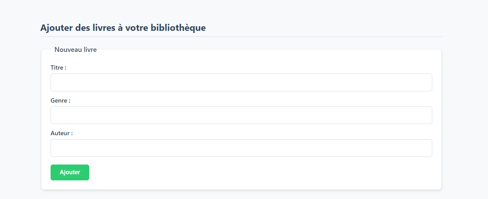
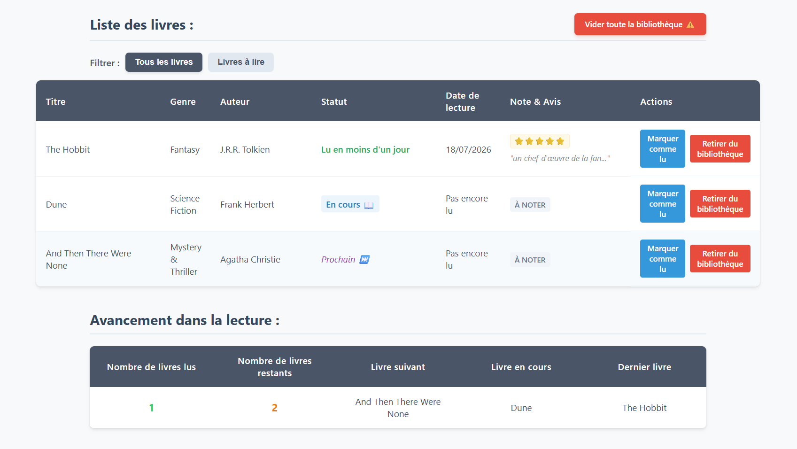
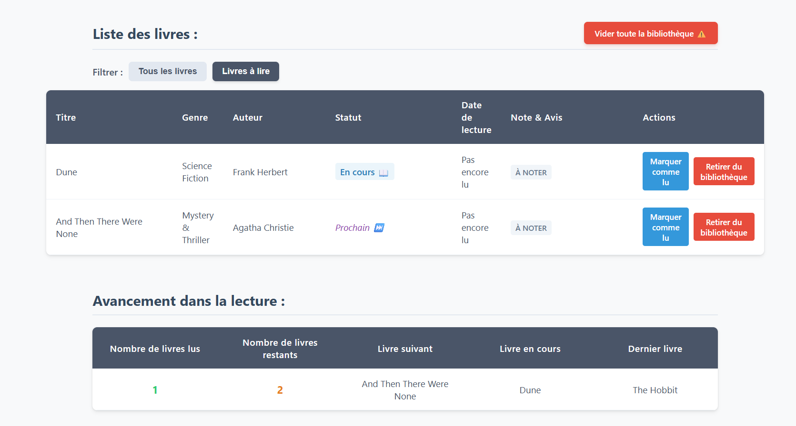

# Object-Oriented Book Library (State-Driven Web App) 📚

An interactive, premium frontend web application designed to manage personal libraries, rank reader metrics, and monitor learning timelines. Built utilizing structured **Object-Oriented Programming (OOP) Classes**, prototype logic inheritance, and localized storage arrays.

## 🛠️ Key Features
- **Modern ES6 Class Architecture:** Developed using native JavaScript classes (`class Livre` & `class ListeLivres`) paired with legacy prototype fallback tracking to separate data structures, mutations, and localized presentation layer rules.
- **Advanced State & Queue Tracking:** Automatically manages dynamic reading tracks (identifying active targets as `En cours 📖`, upcoming items as `Prochain ⏭️`, or completed files) based on advanced index array computations.
- **Persistent Data Storage:** Implements local data persistence routines (`localStorage`) using raw JSON string manipulation and constructor object mappings (`.map()`) to retain structures across page lifecycles.
- **Dynamic Interaction Core:** Features prompt input loops for custom user evaluation reviews ("⭐"), dynamic modal confirms, time duration trackers (calculating days via timestamp offsets), and optimized table transformations onto the centralized `<tbody>` viewport context.

## 🚀 Technologies Used
- **Logic Infrastructure:** JavaScript (ES6 Classes, Prototype Mappings, Array Prototyping, Map Filters, Web Storage API)
- **Structure & Styling:** HTML5 Semantic Form Controls & Tailored Visual Utility CSS Cards

---

## 📸 Application Layout & Screenshots

### 1. Data Collection Core
A clean, centralized form component validating book data titles, genres, and authors smoothly.

### 2. General Registry Dashboard
The master catalog rendering live data rows paired with user interactive actions, dynamic evaluation stars, and real-time statistic widgets.

### 3. Dynamic Array Data Filtering
Advanced array traversal masking completed entries instantaneously without a single viewport refresh.

